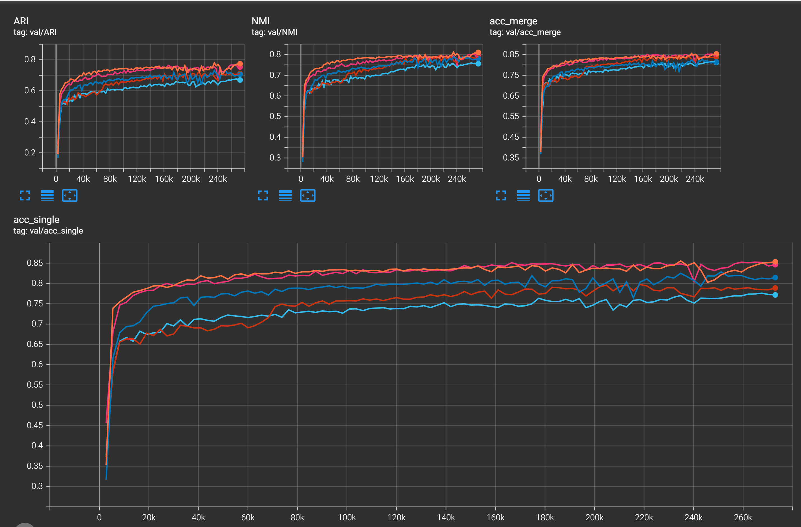

# Deep Clustering with Stochastic Gates

## Implemented methods for MNIST dataset:
 - [Deep CLustering with Concrete K-means](https://arxiv.org/pdf/1910.08031)
 - [NEURAL MANIFOLD CLUSTERING AND EMBEDDING](https://arxiv.org/pdf/2201.10000.pdf) (not verified, the official impl. is [here](https://github.com/zengyi-li/NMCE-release)

## How to run:
- Verify you have Python 3.8.8 (it can work also in 3.7 but was not checked)
- run `pip install -r requirement.txt`
- run the training + evaluation (e.g. CKM method on MNIST dataset):
    `python run.py --cfg cfg/mnist/ckm.yaml`
- to view the logs run `tensorboard --logdir lightning_logs` from the project root dir

## Clustering evaluation of Deep Concrete K-Means on MNIST:

